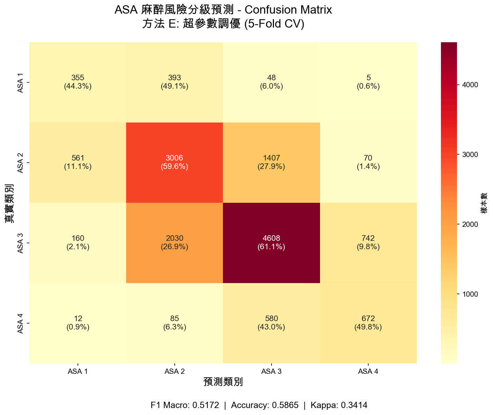
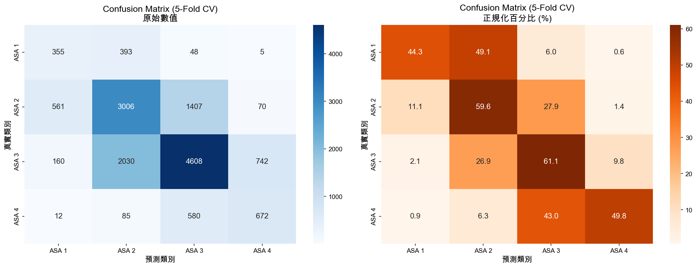

# ASA 預測專案 - 成績追蹤

## Kaggle Public Leaderboard 成績

| 提交順序 | 方法 | 特徵數 | 模型 | Kaggle Score | 相對提升 |
|----------|------|--------|------|--------------|----------|
| 1 | A: Baseline | 13 | LightGBM | 0.46513 | - |
| 2 | B: 完整特徵 | 40 | LightGBM | 0.52588 | +13.1% |
| 3 | C: 交互特徵 | 70 | LightGBM | 0.53120 | +1.0% |
| 4 | D: 模型融合 | 40+70 | LightGBM x2 | 0.52592 | -1.0% |
| 5 | E: 超參數調優 | 70 | LightGBM (tuned) | **0.53809** | **+1.3%** |
| 6 | F: SMOTE | 70 | LightGBM | 0.51602 | -4.1% |
| 7 | G: 三階交互 | 90 | LightGBM (tuned) | 0.53598 | -0.4% |
| 8 | H: 縱向特徵 | 137 | LightGBM (tuned) | 0.51656 | -4.0% |
| 9 | I: 推測病史 | 86 | LightGBM (tuned) | 0.53341 | -0.9% |
| 10 | J: 特徵精選 | 45 | LightGBM (tuned) | 0.50398 | -6.3% |

## 成績趨勢圖

```
Kaggle Score
    ^
0.54|                                    ⭐ E (0.53809)
    |                         C (0.53120)      G (0.53598)  I (0.53341)
0.53|
    |             B (0.52588)  D (0.52592)
0.52|
    |                                              F (0.51602) H (0.51656)
0.51|
    |                                                                      J (0.50398)
0.50|
    |
0.49|
    |
0.48|
    |
0.47|
    | A (0.46513)
0.46|
    +--------------------------------------------------------------------> 時間
        A         B         C         D         E         F         G    H    I    J
```

## 本地驗證分數 vs Kaggle 分數

| 方法 | 本地 F1 | Kaggle Score | 差異 |
|------|---------|--------------|------|
| A | 0.4517 | 0.46513 | +2.9% |
| B | 0.5122 | 0.52588 | +2.7% |
| C | 0.4974 | 0.53120 | +6.8% |
| D | 0.5125 | 0.52592 | +2.6% |
| E | 0.5002 | 0.53809 | +7.6% |
| F | 0.4859 | 0.51602 | +6.2% |
| G | 0.4973 | 0.53598 | +7.8% |
| H | 0.4973 | 0.51656 | +3.9% |
| I | 0.5012 | 0.53341 | +6.4% |
| J | 0.5066 | 0.50398 | **-1.3%** |

**觀察**:
- Kaggle 分數普遍比本地高
- 方法C和E的差異特別大，表示這些方法在測試集上泛化更好
- **方法F (SMOTE) 效果不佳**：Kaggle 分數 0.51602 比方法C下降 2.9%，確認 SMOTE 在此資料集上無效
- **方法J (特徵精選) 是唯一 Kaggle < 本地的方法**：本地 0.5066 但 Kaggle 只有 0.50398，RFE 過擬合訓練資料

## 各方法改進貢獻分析

### 從 Baseline 到最佳成績的貢獻拆解

總提升: 0.46513 → 0.53809 = **+15.7%**

1. **特徵工程 (A→B)**: +13.1%
   - 新增 27 個特徵
   - Lab, Medication, Catheter, 衍生特徵

2. **交互特徵 (B→C)**: +1.0%
   - 新增 30 個二階交互項
   - PolynomialFeatures

3. **超參數調優 (C→E)**: +1.3%
   - Optuna 100 trials
   - 主要調整: learning_rate, n_estimators, regularization

4. **模型融合 (D)**: -1.0% (無效)
   - 融合權重可能不適合

5. **SMOTE (F)**: -4.1% (無效)
   - 過採樣導致模型過擬合合成樣本
   - 破壞了原始資料的分布特性

6. **三階交互 (G)**: -0.4% (無效)
   - 增加 20 個三階交互特徵 (90 vs 70)
   - 更高維度反而引入噪音，效果不如二階交互

7. **縱向特徵 (H)**: -4.0% (無效)
   - 從 Lab_Values 提取重複測量的縱向特徵 (31 個)
   - 加入二階交互後總共 137 個特徵
   - 雖然分析上發現縱向特徵與 ASA 有相關性，但模型表現下降
   - 可能原因：特徵過多導致過擬合、縱向特徵噪音較大

8. **推測病史 (I)**: -0.9% (效果有限)
   - 基於臨床診斷標準從 Lab_Values 推測 8 種共病 (CKD, 糖尿病, 貧血等)
   - 新增 10 個病史特徵 + 36 個交互特徵 = 86 個特徵
   - 雖然推測的病史與 ASA 高度相關 (ASA 4 平均 5 個共病 vs ASA 1 平均 1.2 個)
   - 但可能與現有 lab_abnormal_total 等特徵重疊，未能提供額外資訊

9. **特徵精選 (J)**: -6.3% (嚴重失敗)
   - 「返璞歸真」策略：整合 B+G+H+I 所有 109 個特徵，精選到 45 個
   - 兩階段選擇：Feature Importance (109→80) + RFE (80→45)
   - 本地 F1 達 0.5066 (高於方法 E 的 0.5002)，但 Kaggle 只有 0.50398
   - **這是唯一 Kaggle 分數低於本地的方法**
   - 根本原因：RFE 基於訓練資料選擇特徵，導致嚴重過擬合
   - 教訓：特徵選擇可能破壞模型在測試集上的泛化能力

## 模型評估詳細報告（方法 E: 最佳模型）

### Classification Report (5-Fold CV)

| 類別 | Precision | Recall | F1-Score | Support |
|------|-----------|--------|----------|---------|
| ASA 1 | 0.33 | 0.44 | 0.38 | 801 |
| ASA 2 | 0.55 | 0.60 | 0.57 | 5,044 |
| ASA 3 | 0.69 | 0.61 | 0.65 | 7,540 |
| ASA 4 | 0.45 | 0.50 | 0.47 | 1,349 |
| **Macro Avg** | **0.50** | **0.54** | **0.52** | 14,734 |
| Weighted Avg | 0.60 | 0.59 | 0.59 | 14,734 |

**整體指標**:
- F1 Macro: 0.5172
- Accuracy: 0.5865 (58.65%)
- Cohen's Kappa: 0.3414

### Confusion Matrix (5-Fold CV)

|  | 預測 ASA 1 | 預測 ASA 2 | 預測 ASA 3 | 預測 ASA 4 |
|--|-----------|-----------|-----------|-----------|
| **真實 ASA 1** | **355** | 393 | 48 | 5 |
| **真實 ASA 2** | 561 | **3,006** | 1,407 | 70 |
| **真實 ASA 3** | 160 | 2,030 | **4,608** | 742 |
| **真實 ASA 4** | 12 | 85 | 580 | **672** |

#### 視覺化圖表





### 各類別詳細分析

| 類別 | 樣本數 | 正確預測 | 正確率 | 主要錯誤類型 |
|------|--------|----------|--------|--------------|
| ASA 1 | 801 | 355 | 44.3% | 49.1% 誤判為 ASA 2 |
| ASA 2 | 5,044 | 3,006 | 59.6% | 27.9% 誤判為 ASA 3 |
| ASA 3 | 7,540 | 4,608 | 61.1% | 26.9% 誤判為 ASA 2 |
| ASA 4 | 1,349 | 672 | 49.8% | 43.0% 誤判為 ASA 3 |

### 關鍵發現

1. **ASA 3 表現最佳**: Precision 0.69, Recall 0.61, 是四個類別中最高
2. **ASA 1 最難預測**: 正確率僅 44.3%，近半數被誤判為 ASA 2
3. **相鄰類別混淆嚴重**:
   - ASA 1 ↔ ASA 2 (邊界模糊)
   - ASA 2 ↔ ASA 3 (大量混淆)
   - ASA 3 ↔ ASA 4 (高風險患者區分困難)
4. **類別不平衡影響**: ASA 1 (5.4%) 和 ASA 4 (9.2%) 樣本少，預測較困難

---

## 待測試項目

- [x] F: SMOTE 提交 Kaggle → **0.51602 (無效)**
- [x] G: 三階交互 提交 Kaggle → **0.53598 (無效，略低於E)**
- [x] H: 縱向特徵 提交 Kaggle → **0.51656 (無效，下降4.0%)**
- [x] I: 推測病史 提交 Kaggle → **0.53341 (效果有限，下降0.9%)**
- [x] J: 特徵精選 提交 Kaggle → **0.50398 (嚴重失敗，下降6.3%)**
- [ ] 調整融合權重 (B:0.3, C:0.7)
- [ ] XGBoost/CatBoost 調優

---

*最後更新: 2026-02-04*
*當前最佳: 方法 E (0.53809)*
